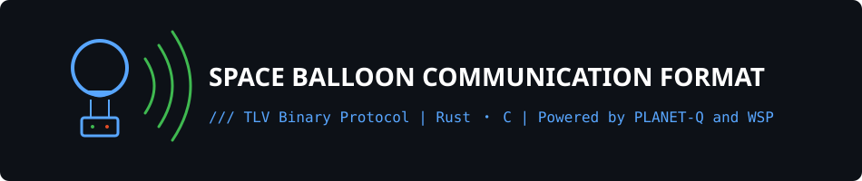

<p align="center">
  
</p>

<p align="center">
  
  
  
  
</p>

成層圏気球から、地上へセンサの値を届けるための通信フォーマットです。

PLANET-Q の共通通信フォーマット（`pq_com_format`）をフレームにして、地上のテレメバックエンドが対応表を見ながら中身を読みます。

## 🫧 なにをするの

気球と地上局のあいだで、長さの変わるセンサ値をやり取りします。中身は TLV（Tag-Length-Value）を並べたペイロードで、外側のわくだけ決まっています。

| 層 | やること | 場所 |
| --- | --- | --- |
| フレーム | バイト列のエンコード・デコード。開始・終了マーカー、宛先 / 送信元、CRC、バイトスタッフィング | C: [`c/`](c/)（いまここ）<br>Rust: [`rust/crates/pq-com-format`](rust/crates/pq-com-format)（移植中） |
| 解釈 | 対応表に沿って TLV を名前付きの値にする | Rust: [`rust/crates/downlink`](rust/crates/downlink)（移植中） |
| 対応表 | ノード ID とタグの定義 | [`spec/downlink.yaml`](spec/downlink.yaml)（例） |

## 📦 フレームのかたち

気球からのひと包みは、こんな形です。

```text
0x7E | 宛先ID | 送信元ID | ペイロード長 | ペイロード | CRC16 | 0x7F
```

ペイロードは `Tag(1) + Length(1) + Value(n)` をそのままつなげたもの。途中に `0x7E` / `0x7F` / `0x7D` が出てきたら、区切りと混ざらないようにスタッフィングします。

フレームの詳細は [docs/pq_com_format.md](docs/pq_com_format.md) にまとめてあります。

## 🗂️ なかみ

```text
c/        いま動いている C の実装とテスト
rust/     これから育てる Rust ワークスペース
spec/     「このタグは気圧」のような対応表
docs/     プロトコルの説明
scripts/  対応表まわりの小さなお手伝い
```

## 🛠️ 動かしてみる

### C

Ninja と CMake 3.16 以降があれば大丈夫です。

```sh
cd c
cmake --preset default
cmake --build --preset default
ctest --preset default
```

リリース用は preset 名を `release` に、基板に載せる用（テストなし）は `embedded` にしてください。

### Rust

```sh
cargo test --manifest-path rust/Cargo.toml
```

ワークスペースは `pq-com-format` と `downlink` の 2 クレートです。中身は、これからふくらませていきます。

## 📜 ライセンス

フォーク元である[pq_com_format](https://github.com/planet-q/pq_com_format)よりライセンスを継承し，MITで再配布しております．[LICENSE](LICENSE)をご覧ください．


Copyright (C) 2024-2026 PLANET-Q

Copyright (C) 2026- PLANET-Q and WSP
